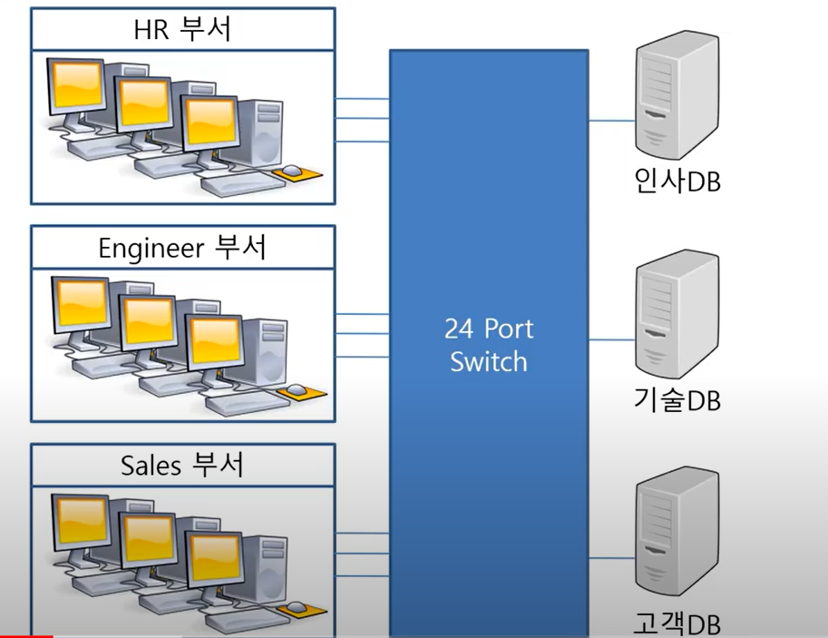

# CS_Study 네트워크&데이터 통신(3/26)

## 1. VLAN이란 무엇인가요? 어떤 장점이 있나요?

- 자료조사
    
    VLAN(Virtual Local Area Network)은 하나의 물리적인 LAN(Local Area Network)을 논리적인 그룹으로 분할하는 기술입니다. VLAN은 물리적인 위치와는 관계없이 같은 그룹에 속한 장치들끼리 통신할 수 있도록 해주는 가상 네트워크입니다.
    
    - 예시
        
        
        
        - 24포트의 switch의 불필요한 이용
        
        
        
        - 하나의 스위치로 구현 할 수 없을까?
        
        
        
        - 데이터 프레임의 헤더에 그룹 번호를 붙인다.
        
    - VLAN의 장점은 다음과 같습니다.
        1. 대역폭 효율성: VLAN을 사용하면 서로 다른 그룹 간의 네트워크 트래픽을 격리시킬 수 있으므로, 서로 다른 그룹 간의 대역폭을 효율적으로 분배할 수 있습니다.
        2. 비용 절감: VLAN을 사용하면 물리적인 LAN을 추가하지 않고도 네트워크를 확장할 수 있으므로 비용이 절감됩니다.
        3. 보안성: VLAN은 하나의 물리적인 LAN을 가상적으로 분할하기 때문에, 특정 그룹의 장치들 간의 통신을 다른 그룹으로부터 격리시킬 수 있습니다. 이를 통해 네트워크 보안을 강화할 수 있습니다.
        4. 관리 용이성: VLAN을 사용하면 관리자는 필요에 따라 네트워크의 논리적 구성을 변경할 수 있습니다. VLAN을 사용하여, 스위치의 포트를 이동하거나 새로운 그룹을 추가하는 등의 네트워크 구성 변경이 용이해집니다.
- 답변
    
    VLAN은 하나의 물리적인 LAN을 논리적인 그룹으로 분할하는 기술로 네트워크 구성을 유연하게 하고  보안성을 높이며 효율적으로 관리할 수 있다는 장점이 있습니다.
    
- Reference
    
    [VLAN 위키백과](https://ko.wikipedia.org/wiki/%EA%B0%80%EC%83%81_%EB%9E%9C)
    
    [IT BEST-PATH 유튜브](https://www.youtube.com/watch?v=ILv_-eQX7XU)
